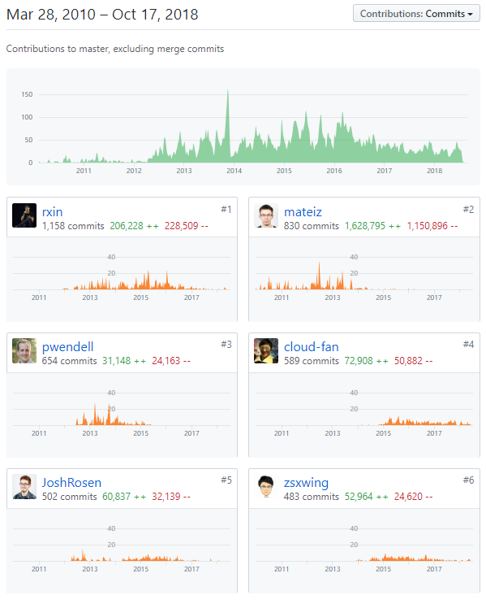
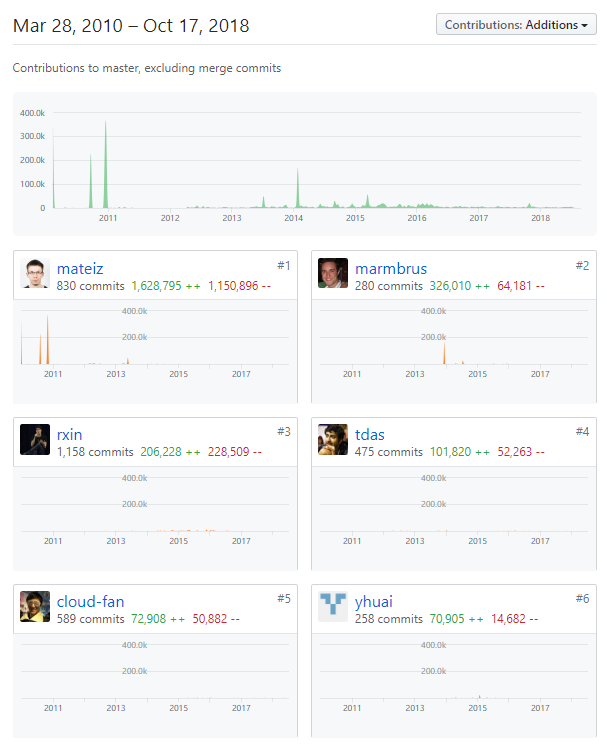
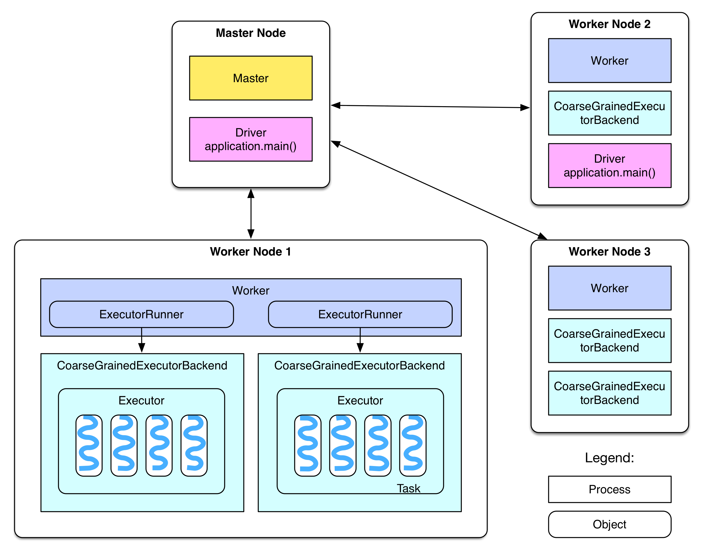
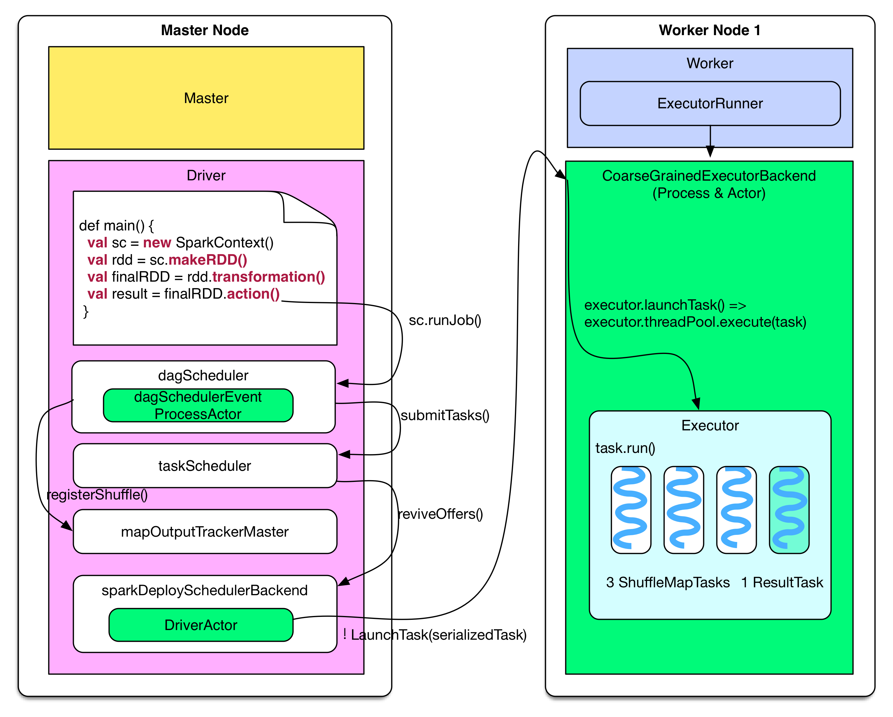
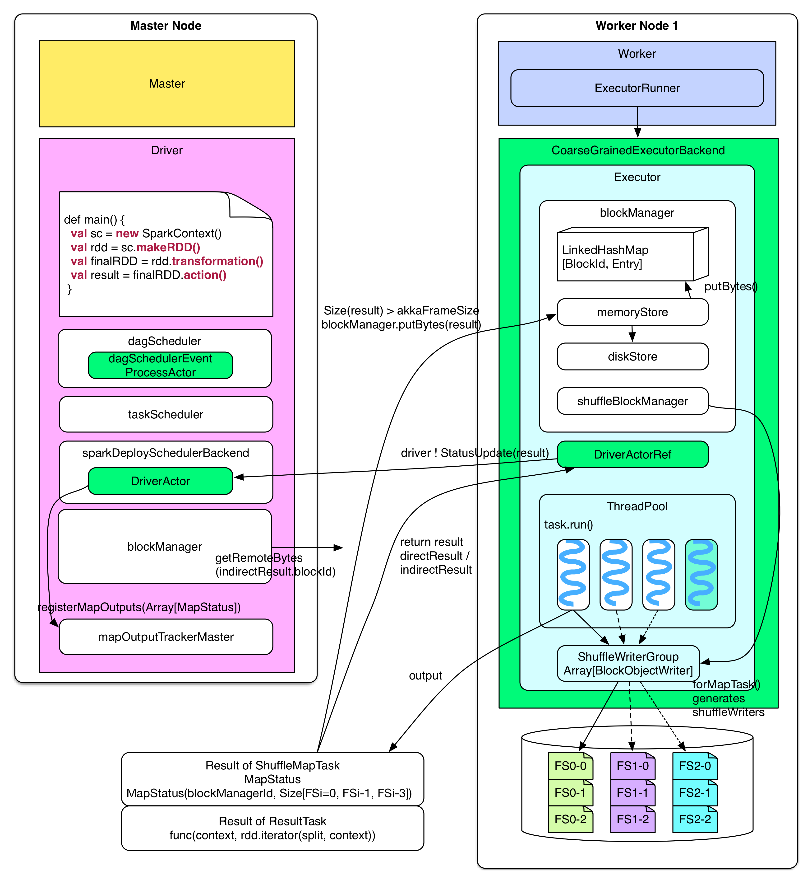
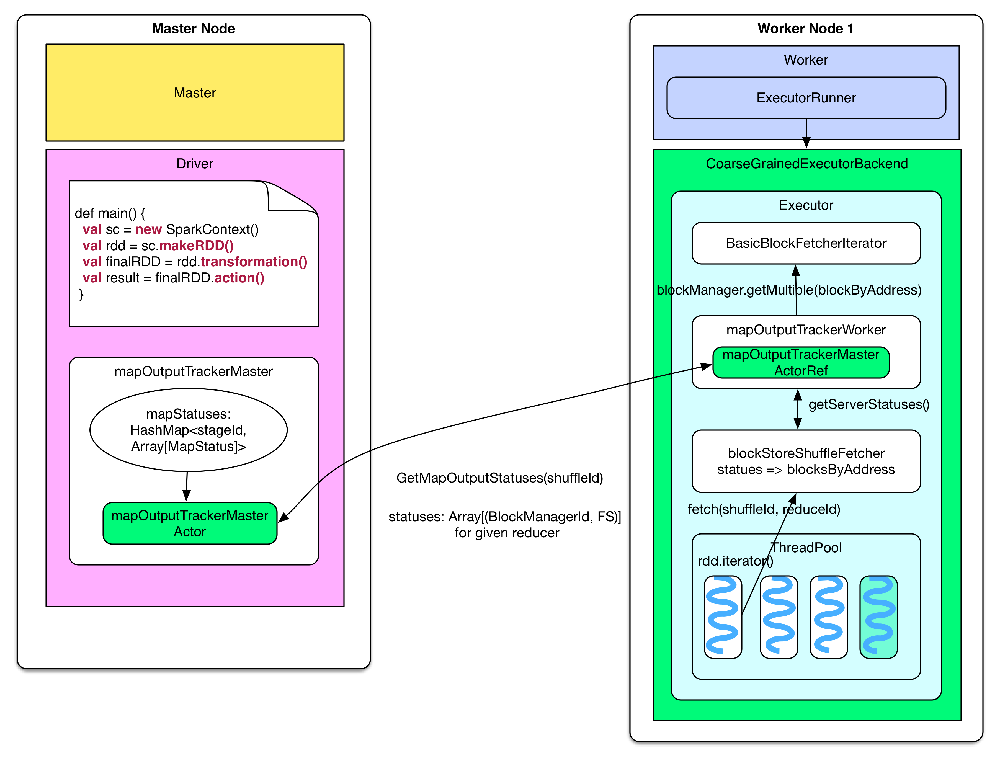
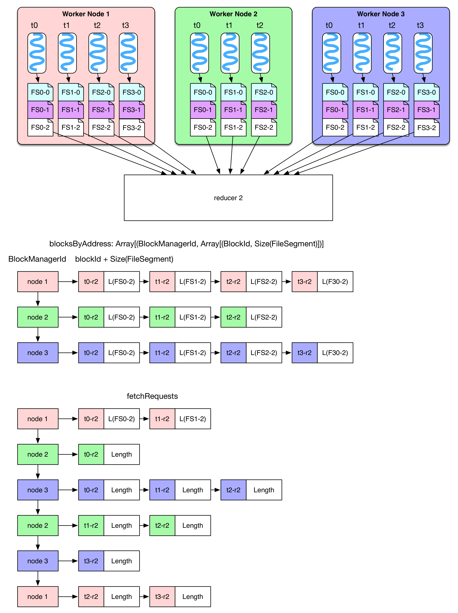
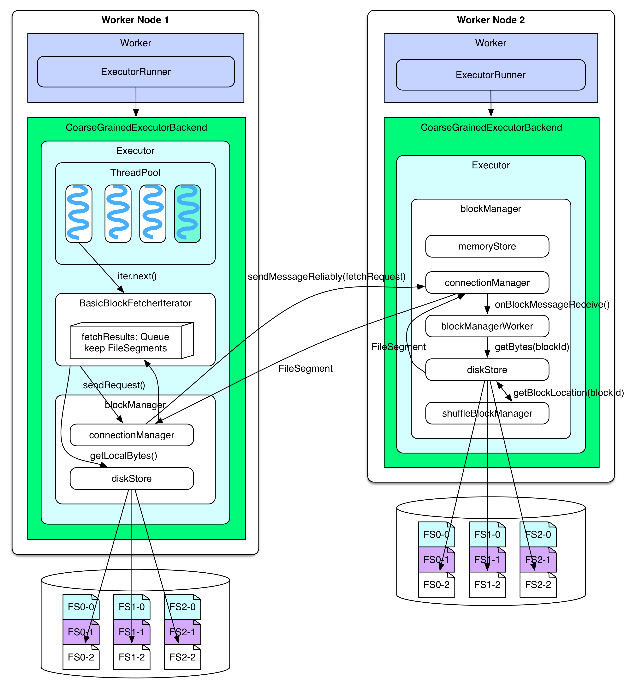

# Apache Spark™ - Unified Analytics Engine for Big Data


# Abstract

Spark is a general-purpose data processing engine that is suitable for use in a wide range of circumstances providing interfaces in a variety of programming languages including **Scala**, **Java** and **Python**. Application developers and data scientists incorporate Spark into their applications to rapidly query, analyze, and transform data at scale. Tasks most frequently associated with Spark include interactive queries across large data sets, processing of streaming data from sensors or financial systems, and machine learning tasks. As of 21-09-2018, the project has over 22,000 commits, 1285 contributors, 75 releases and has been forked over 16,000 times.


# Table of Contents

1. Overview
2. stakeholders
3. Deployment view
4. Context view
5. Architecture
6. Functional View
7. Evolution perspective
8. Summary
9. References


# 1 Overview

## 1.1 Introduction

Apache Spark is a fast and general-purpose cluster computing system. It provides high-level APIs in Java, Scala, Python and R, and an optimized engine that supports general execution graphs. It also supports a rich set of higher-level tools including Spark SQL for SQL and structured data processing, MLlib for machine learning, GraphX for graph processing, and Spark Streaming.


## 1.2 Spark DataType

RDD (Resilient Distributed Dataset), which is the most basic data abstraction in Spark. It represents aset that is immutable, partitioned, and whose elements can be calculated in parallel. RDD has the characteristics of data flow model: automatic fault tolerance, location-aware scheduling, and scalability. RDD allows users to explicitly cache working sets in memory while performing multiple queries, and subsequent queries can reuse working sets, which greatly increases query speed.

By introducing the concept of RDD, Spark provides efficient big data operations without incurs substantial overheads due to data replication, disk I/O, and serialization, which can dominate application execution times. In addition, RDDs are fault-tolerant, parallel data structures that let users explicitly persist intermediate results in memory, control their partitioning to optimize data placement, and manipulate them using a rich set of operators.

After evaluating RDDs and Spark through both microbenchmarks and measurements of user applications, we find that Spark is up to 20× faster than **Hadoop** for iterative applications, speeds up a real-world data analytics report by 40×, and can be used interactively to scan a 1 TB dataset with 5–7s latency.

## 1.3 Security

Spark currently supports authentication via a shared secret. Authentication can be configured to be on via the `spark.authenticate` configuration parameter. This parameter controls whether the Spark communication protocols do authentication using the shared secret. This authentication is a basic handshake to make sure both sides have the same shared secret and are allowed to communicate. If the shared secret is not identical they will not be allowed to communicate. The shared secret is created as follows:

- For Spark on YARN deployments, configuring `spark.authenticate` to true will automatically handle generating and distributing the shared secret. Each application will use a unique shared secret.
- For other types of Spark deployments, the Spark parameter `spark.authenticate.secret` should be configured on each of the nodes. This secret will be used by all the Master/Workers and applications.

## 1.4 Applicable scenario

At present, big data processing scenarios have the following types:

1. Complex Batch Data Processing focuses on the ability to process massive Data. As for the tolerable Processing speed, the usual time may be from dozens of minutes to several hours.

2. Interactive Query based on historical data, which usually takes between tens of seconds and tens of minutes

3. Data Processing based on real-time Data flow, usually between hundreds of milliseconds and seconds

Currently, there are mature processing frameworks for the above three scenarios. In the first case, Hadoop's MapReduce can be used for bulk mass data processing, in the second case, Impala can be used for interactive query, and in the third case, Storm distributed processing framework can be used to process real-time streaming data. All of the above three are relatively independent, each of which has a relatively high maintenance cost, and the emergence of Spark can satisfy the requirements above.

Based on the above analysis, the Spark scenario is summarized as follows:

- Spark is a memory based iterative computing framework for applications that require multiple manipulation of a particular dataset. The more repeated operations are required, the greater the amount of data to be read and the greater the benefit, and the smaller the amount of data but the more intensive the calculation, the less benefit

- Because of RDD's features, Spark doesn't apply to applications that are asynchronous and fine-grained update states, such as the storage of web services or incremental web crawlers and indexes. It's just not a good model for that incremental change

- The statistical analysis whose amount of data is not particularly large, but requires real-time 

## 1.5 Technical Platform
### 1.5.1 Running Environment
- Spark is created by Scala, it could run on JVM so we need Java7 or higher edition.
- If we use Python API, we need Python2.6+ or Python3.4+.
- Edition mapping:
Spark1.6.2--Scala2.10;
Spark2.0.0--Scala2.11;


## 1.6 Installing Spark Standalone to a Cluster

To install Spark Standalone mode, you simply place a compiled version of Spark on each node on the cluster. You can obtain pre-built versions of Spark with each release or [build it yourself](http://spark.apache.org/docs/latest/building-spark.html).

### Starting a Cluster Manually

You can start a standalone master server by executing:

`./sbin/start-master.sh`

Once started, the master will print out a spark://HOST:PORT URL for itself, which you can use to connect workers to it, or pass as the “master” argument to SparkContext. You can also find this URL on the master’s web UI, which is http://localhost:8080 by default.

Similarly, you can start one or more workers and connect them to the master via:

`./sbin/start-slave.sh <master-spark-URL>`

Once you have started a worker, look at the master’s web UI (http://localhost:8080 by default). You should see the new node listed there, along with its number of CPUs and memory (minus one gigabyte left for the OS).


# 2 stakeholders

## 2.1 Major contributors
the major contrubitors who developed spark
are:

- Reynold Xin
- Matei Zaharia
- Michael Armbrust
- Wenchen Fan
- Patrick Wendell
- Josh Rosen
- Tathagata Das
- Cheng Lian





And the companies below majorly contributed spark

- University of California, Berkeley
- Databricks
- Yahoo
- Intel
## 2.2 Customers and Users detail
- Currently, more than 30+ company 100+ developers are submitting code

- Cloudera, one of Hadoop's largest vendors, claims to be investing more in the Spark framework to replace Mapreduce
- Hortonworks
- MapR, a Hadoop manufacturer, has launched the Spark camp
- Apache Mahout abandons MapReduce and USES Spark as the computing platform for subsequent operators
- Hortonworks，Tecent，Yahoo，Alibaba，Youku and more company at home and abroad are using spark to replace the old framework to improve efficiency.

# 3 DeploymentView

## 3.1 Deployment methods:

### 3.1.1 Standalone
Use the resource scheduling framework that comes with spark: (not dependent on other distributed management platforms)

Steps:
1. SparkContext connects to the Master, registers with the Master and applies for resources (CPU Core and Memory)
2. Master gets the resources on the Worker, then starts StandaloneExecutorBackend;
3. StandaloneExecutorBackend registers with SparkContext;
4. SparkContext sends the Applicaiton code to StandaloneExecutorBackend;
5. SparkContext parses the Applicaiton code, builds the DAG map, submits it to the DAG Scheduler and decomposes it into a Stage, and then submits it to the Task Scheduler in a Stage (or called TaskSet). 
6. The Task Scheduler is responsible for assigning the Task to The corresponding Worker is finally submitted to StandaloneExecutorBackend for execution;
7. StandaloneExecutorBackend will create an Executor thread pool, start executing the Task, and report to the SparkContext until the Task is completed.
8. After all Tasks are completed, SparkContext logs out to the Master and releases the resources.

### 3.1.2 Spark on Mesos
Mesos is an open source distributed resource management framework under Apache. It is called the kernel of distributed systems.
Spark is used to support multi-server simultaneous operations in the running of mesos.
Steps:
1. Submit the task to spark-mesos-dispatcher via spark-submit
2. spark-mesos-dispatcher submits to mesos master via driver and receives task ID
3. mesos master is assigned to the slave to let it perform the task
4. spark-mesos-dispatcher, query task status by task ID


### 3.1.3 Spark on YARN
Apache Hadoop YARN (Yet Another Resource Negotiator, another resource coordinator) is a new Hadoop resource manager, which is a universal resource management system.
It includes two main part:RM,AM
RM(Resource Manager):It allocates the required resource of the process. It acts as a JobTracker. It faces to the whole system;
AM(Application Manager):It manages and consoles the status and data of the process. It acts as a TaskTracker. It faces to every single process.


# 5 Architecture

## High-level diagram


The high-level view is visualized in figure above.

Looking from upper level, every **Spark** application initiate a variety of parallel operations in cluster from a **driver program**. Program driver access Spark through a **SparkContext** object. This object represents a connection to the entire cluster. By default, a SparkContext object named `sc` will be created by shell automatically.

~~~python
>>> lines = sc.textFile("README.md")
>>> lines.count()
~~~

User can define RDDs through program driver and then initiate an operation. A simple example is presented above.

As soon as the driver program receive an operation, it will try to distribute the operation over all working nodes. Each working nodes will do a part of jobs and send result back to driver program.


## Component diagram 


The Component view is showed in the picture above.

Spark contains several components ,including Spark Core, Spark SQL, Spark Streaming, MLlib, GraphX and Cluster Manager. These components are closely related to each other, which means if we update one component, others can also be affected. By using this theory, Spark has had lots of advantages. And now, we'll introduce these components and show the relations among them.

1.Spark Core
Spark Core implements the basic functions of Spark, including task scheduling, memory management, error recovery, and storage systems. It also defines an API for RDD(resilient distribute dataset).

2.Spark SQL
Spark SQL is a package that Spark uses to manipulate structured data. With Spark SQL, we can use SQL Or the Apache Hive version of the SQL(HQL) to query data. Spark SQL supports multiple data sources, Such as Hive table, Parquet and JSON.

3.Spark Streaming
Spark Streaming is a component of Spark that provides streaming computing for real-time data. Spark Streaming provides an API for manipulating data streams and is highly responsive to the RDD API in Spark Core.

4.Spark MLlib
Spark also includes a library that provides machine learning (ML) features called MLlib. MLlib provides a variety of machine learning algorithms, including classification, regression, clustering, collaborative filtering, etc.

5.Spark GraphX
GraphX is a library for manipulating graphs that can perform parallel graph calculations.

6.Cluster Manager
Spark can efficiently scale calculations from one compute node to thousands of compute nodes.

### Layer Structure


The Components we list above are organized in a Layer Structure. Spark Core is the basic layer which can create RDD and basic function to support the upper layer. Spark SQL, Spark Streaming, MLlib and GraphX consist the second layer, which implements most of the function of Spark. The top layer is a Cluster Master which can organize the task created by users. By using this structure, Spark is easy to learn and use. What's more, it can be deployed in different platforms and work efficiently.   

## Component and Connector diagram


After the Spark cluster is deployed, you need to start the Master process and the Worker process on the master node and the slave node respectively to control the entire cluster. Driver and Worker are two important roles in the execution of a Spark application. The Driver program is the starting point for the execution of the application logic. It is responsible for the scheduling of jobs, that is, the distribution of Task tasks, and multiple Workers are used to manage computing nodes and create Executor parallel processing tasks. In the execution phase, the Driver serializes the files and jars that the Task and Task depend on and passes them to the corresponding Worker machine. At the same time, the Executor processes the tasks of the corresponding data partitions.

The basic parts of Spark's architecture in the runtime:

• Cluster Manager: In the standalone mode, it is the master master node, which controls the entire cluster and monitors the workers. Resource manager in YARN mode

• Worker: The slave node is responsible for controlling the compute node and starting the Executor or Driver. In the YARN mode, it is the NodeManager, which is responsible for the control of the computing node.

• Driver: Run the main() function of the Application and create a SparkContext.

• Executor: The executor, the component that performs the task on the worker node, and the task that is used to start the thread pool. Each Application has a separate set of Executors.

• SparkContext: The context of the entire application, controlling the lifecycle of the application.

• RDD: The basic computing unit of Spark, a set of RDDs can form a directed acyclic graph RDD Graph.

• DAG Scheduler: Build a Stage-based DAG based on the task and submit the Stage to the TaskScheduler.

• TaskScheduler: Distribute tasks to Executor for execution.

• SparkEnv: A thread-level context that stores references to important portions of the runtime.

## Deployment diagram



Next, we will talk about some details about it.

## Job submission

The diagram below illustrates how driver program (on master node) produces job, and then submits it to worker nodes.



Driver side behavior is equivalent to the code below:

```scala
finalRDD.action()
=> sc.runJob()

// generate job, stages and tasks
=> dagScheduler.runJob()
=> dagScheduler.submitJob()
=>   dagSchedulerEventProcessActor ! JobSubmitted
=> dagSchedulerEventProcessActor.JobSubmitted()
=> dagScheduler.handleJobSubmitted()
=> finalStage = newStage()
=>   mapOutputTracker.registerShuffle(shuffleId, rdd.partitions.size)
=> dagScheduler.submitStage()
=>   missingStages = dagScheduler.getMissingParentStages()
=> dagScheduler.subMissingTasks(readyStage)

// add tasks to the taskScheduler
=> taskScheduler.submitTasks(new TaskSet(tasks))
=> fifoSchedulableBuilder.addTaskSetManager(taskSet)

// send tasks
=> sparkDeploySchedulerBackend.reviveOffers()
=> driverActor ! ReviveOffers
=> sparkDeploySchedulerBackend.makeOffers()
=> sparkDeploySchedulerBackend.launchTasks()
=> foreach task
      CoarseGrainedExecutorBackend(executorId) ! LaunchTask(serializedTask)
```

Explanation:

When the following code is evaluated, the program will launch a bunch of driver communications, e.g. job's executors, threads, actors, etc. 

```scala
val sc = new SparkContext(sparkConf)
```

**This line defines the role of driver**

### Job logical plan

`transformation()` in driver program builds a computing chain (a series of `RDD`). In each `RDD`:
-	`compute()` function defines the computation of records for its partitions
-	`getDependencies()` function defines the dependency relationship across RDD partitions.

### Job physical plan

Each `action()` triggers a job:
-	During `dagScheduler.runJob()`, different stages are defined
-	During `submitStage()`, `ResultTasks` and `ShuffleMapTasks` needed by the stage are produced, then they are packaged in `TaskSet` and sent to `TaskScheduler`. If `TaskSet` can be executed, tasks will be submitted to `sparkDeploySchedulerBackend` which will distribute tasks.


### Task distribution

After `sparkDeploySchedulerBackend` gets `TaskSet`, the `Driver Actor` sends serialized tasks to `CoarseGrainedExecutorBackend Actor` on worker node.

## Job reception

After receiving tasks, worker will do the following things:

```scala
coarseGrainedExecutorBackend ! LaunchTask(serializedTask)
=> executor.launchTask()
=> executor.threadPool.execute(new TaskRunner(taskId, serializedTask))
```
**Executor packages each task into `taskRunner`, and picks a free thread to run the task. A `CoarseGrainedExecutorBackend` process has exactly one executor**

## Task execution
 
The diagram below shows the execution of a task received by worker node and how driver processes task results.



After receiving a serialized task, the executor deserializes it into a normal task, and then runs the task to get `directResult` which will be sent back to driver. It is noteworthy that data package sent from `Actor` can not be too big:

-	If the result is too big (e.g. the one of `groupByKey`), it will be persisted to "memory + hard disk" and managed by `blockManager`. Driver will only get `indirectResult` containing the storage location. When result is needed, driver will fetch it via HTTP.
-	If the result is not too big (less than `spark.akka.frameSize = 10MB`), then it will be directly sent to driver.

**Some more details about `blockManager`:**

When `directResult > akka.frameSize`, the `memoryStore` of `BlockManager` creates a `LinkedHashMap` to hold the data stored in memory whose size should be less than `Runtime.getRuntime.maxMemory * spark.storage.memoryFraction(default 0.6)`. If `LinkedHashMap` has no space to save the incoming data, these data will be sent to `diskStore` which persists data to hard disk if the data `storageLevel` contains "disk"

```scala
In TaskRunner.run()
// deserialize task, run it and then send the result to 
=> coarseGrainedExecutorBackend.statusUpdate()
=> task = ser.deserialize(serializedTask)
=> value = task.run(taskId)
=> directResult = new DirectTaskResult(ser.serialize(value))
=> if( directResult.size() > akkaFrameSize() ) 
       indirectResult = blockManager.putBytes(taskId, directResult, MEMORY+DISK+SER)
   else
       return directResult
=> coarseGrainedExecutorBackend.statusUpdate(result)
=> driver ! StatusUpdate(executorId, taskId, result)
```
The results produced by `ShuffleMapTask` and `ResultTask` are different.

-	`ShuffleMapTask` produces `MapStatus` containing 2 parts:
	-	the `BlockManagerId` of the task's `BlockManager`: (executorId + host, port, nettyPort）
	-	the size of each output `FileSegment` of a task

-	`ResultTask` produces the execution result of the specified `function` on one partition
	e.g. The `function` of `count()` is simply for counting the number of records in a partition. Since `ShuffleMapTask` needs `FileSegment` for writing to disk, `OutputStream` writers are needed. These writers are produced and managed by `blockManger` of `shuffleBlockManager`

```scala
In task.run(taskId)
// if the task is ShuffleMapTask
=> shuffleMapTask.runTask(context)
=> shuffleWriterGroup = shuffleBlockManager.forMapTask(shuffleId, partitionId, numOutputSplits)
=> shuffleWriterGroup.writers(bucketId).write(rdd.iterator(split, context))
=> return MapStatus(blockManager.blockManagerId, Array[compressedSize(fileSegment)])

//If the task is ResultTask
=> return func(context, rdd.iterator(split, context))
```

A series of operations will be executed after driver gets a task's result:

`TaskScheduler` will be notified that the task is finished, and its result will be processed: 
-	If it is `indirectResult`, `BlockManager.getRemotedBytes()` will be invoked to fetch actual results.
	-	If it is `ResultTask`, `ResultHandler()` invokes driver side computation on result (e.g. `count()` take `sum` operation on all ResultTask).
	-	If it is `MapStatus` of `ShuffleMapTask`, then `MapStatus` will be put into `mapStatuses` of `mapOutputTrackerMaster`, which makes it more easy to be queried during reduce shuffle.
-	If the received task on driver is the last task in the stage, then next stage will be submitted. If the stage is already the last one, `dagScheduler` will be informed that the job is finished.

```scala
After driver receives StatusUpdate(result)
=> taskScheduler.statusUpdate(taskId, state, result.value)
=> taskResultGetter.enqueueSuccessfulTask(taskSet, tid, result)
=> if result is IndirectResult
      serializedTaskResult = blockManager.getRemoteBytes(IndirectResult.blockId)
=> scheduler.handleSuccessfulTask(taskSetManager, tid, result)
=> taskSetManager.handleSuccessfulTask(tid, taskResult)
=> dagScheduler.taskEnded(result.value, result.accumUpdates)
=> dagSchedulerEventProcessActor ! CompletionEvent(result, accumUpdates)
=> dagScheduler.handleTaskCompletion(completion)
=> Accumulators.add(event.accumUpdates)

// If the finished task is ResultTask
=> if (job.numFinished == job.numPartitions) 
      listenerBus.post(SparkListenerJobEnd(job.jobId, JobSucceeded))
=> job.listener.taskSucceeded(outputId, result)
=>    jobWaiter.taskSucceeded(index, result)
=>    resultHandler(index, result)

// If the finished task is ShuffleMapTask
=> stage.addOutputLoc(smt.partitionId, status)
=> if (all tasks in current stage have finished)
      mapOutputTrackerMaster.registerMapOutputs(shuffleId, Array[MapStatus])
      mapStatuses.put(shuffleId, Array[MapStatus]() ++ statuses)
=> submitStage(stage)
```

## Shuffle read

In the preceding paragraph, we talked about task execution and result processing, now we will talk about how reducer (tasks needs shuffle) gets the input data. The shuffle read part in last chapter has already talked about how reducer processes input data.

**How does reducer know where to fetch data ?**



Reducer needs to know on which node the `FileSegments` produced by `ShuffleMapTask` of parent stage are. **This kind of information is sent to driver’s `mapOutputTrackerMaster` when `ShuffleMapTask` is finished. The information is also stored in `mapStatuses: HashMap[stageId, Array[MapStatus]]`**. Given `stageId`, we can get`Array[MapStatus]` which contains information about `FileSegments` produced by `ShuffleMapTasks`. `Array(taskId)` contains the location(`blockManagerId`) and the size of each `FileSegment`.

When reducer need fetch input data, it will first invoke `blockStoreShuffleFetcher` to get input data’s location (`FileSegments`). `blockStoreShuffleFetcher` calls local `MapOutputTrackerWorker` to do the work. `MapOutputTrackerWorker` uses `mapOutputTrackerMasterActorRef` to communicate with `mapOutputTrackerMasterActor` in order to get `MapStatus`. `blockStoreShuffleFetcher` processes `MapStatus` and finds out where reducer should fetch `FileSegment` information, and then it stores this information in `blocksByAddress`. `blockStoreShuffleFetcher` tells `basicBlockFetcherIterator` to fetch `FileSegment` data.

```scala
rdd.iterator()
=> rdd(e.g., ShuffledRDD/CoGroupedRDD).compute()
=> SparkEnv.get.shuffleFetcher.fetch(shuffledId, split.index, context, ser)
=> blockStoreShuffleFetcher.fetch(shuffleId, reduceId, context, serializer)
=> statuses = MapOutputTrackerWorker.getServerStatuses(shuffleId, reduceId)

=> blocksByAddress: Seq[(BlockManagerId, Seq[(BlockId, Long)])] = compute(statuses)
=> basicBlockFetcherIterator = blockManager.getMultiple(blocksByAddress, serializer)
=> itr = basicBlockFetcherIterator.flatMap(unpackBlock)
```



After `basicBlockFetcherIterator` has received the task of data retrieving, it produces several `fetchRequest`s. **Each of them contains the tasks to fetch `FileSegment`s from several nodes. **According to the diagram above, we know that `reducer-2` needs to fetch `FileSegment`(FS)(in white) from 3 worker nodes. The global data fetching task can be represented by `blockByAddress`: 4 blocks from node 1, 3 blocks from node 2, and 4 blocks from node 3

In order to accelerate data fetching process, it makes sense to divide the global tasks into sub tasks(`fetchRequest`), then every task takes a thread to fetch data. Spark launches 5 parallel threads for each reducer (the same as Hadoop). Since the fetched data will be buffered into memory, one fetch is not able to take too much data (no more than `spark.reducer.maxMbInFlight＝48MB`). **Note that `48MB` is shared by the 5 fetch threads,** so each sub task should take no more than `48MB / 5 = 9.6MB`. In the diagram, on node 1, we have `size(FS0-2) + size(FS1-2) < 9.6MB, but size(FS0-2) + size(FS1-2) + size(FS2-2) > 9.6MB`, so we should break between `t1-r2` and `t2-r2`. As a result, we can see 2 `fetchRequest`s fetching data from node 1. **Will there be `fetchRequest` larger than 9.6MB?** The answer is yes. If one `FileSegment` is too large, it still needs to be fetched in one shot. Besides, if reducer needs some `FileSegment`s already existing on the local, it will do local read. At the end of shuffle read, it will deserialize fetched `FileSegment` and offer record iterators to `RDD.compute()`

```scala
In basicBlockFetcherIterator:

// generate the fetch requests
=> basicBlockFetcherIterator.initialize()
=> remoteRequests = splitLocalRemoteBlocks()
=> fetchRequests ++= Utils.randomize(remoteRequests)

// fetch remote blocks
=> sendRequest(fetchRequests.dequeue()) until Size(fetchRequests) > maxBytesInFlight
=> blockManager.connectionManager.sendMessageReliably(cmId, 
	   blockMessageArray.toBufferMessage)
=> fetchResults.put(new FetchResult(blockId, sizeMap(blockId)))
=> dataDeserialize(blockId, blockMessage.getData, serializer)

// fetch local blocks
=> getLocalBlocks() 
=> fetchResults.put(new FetchResult(id, 0, () => iter))
```

Some more details:

**How does the reducer send `fetchRequest` to the target node? How does the target node process `fetchRequest`, read and send back `FileSegment` to reducer?**



When `RDD.iterator()` meets `ShuffleDependency`, `BasicBlockFetcherIterator` will be called to fetch `FileSegment`s. `BasicBlockFetcherIterator` uses `connectionManager` of `blockManger` to send `fetchRequest` to `connectionManager`s on the other nodes. NIO is used for communication between `connectionManager`s. On the other nodes, for example, after `connectionManager` on worker node 2 receives a message, it will forward the message to `blockManager`. The latter uses `diskStore` to read `FileSegment`s requested by `fetchRequest` locally, they will still be sent back by `connectionManager`. If `FileConsolidation` is activated, `diskStore` needs the location of `blockId` given by `shuffleBolockManager`. If `FileSegment` is no more than `spark.storage.memoryMapThreshold = 8KB`, then diskStore will put `FileSegment` into memory when reading it, otherwise, The memory mapping method in `FileChannel` of `RandomAccessFile` will be used to read `FileSegment`, thus large `FileSegment` can be loaded into memory.

When `BasicBlockFetcherIterator` receives serialized `FileSegments` from the other nodes, it will deserialize and put them in `fetchResults.Queue`. You may notice that **`fetchResults.Queue` is similar to `softBuffer` in `Shuffle detials` chapter.** If the `FileSegment`s needed by `BasicBlockFetcherIterator` are local, they will be found locally by `diskStore`, and put in `fetchResults`. Finally, reducer reads the records from `FileSegment` and processes them.

```scala
After the blockManager receives the fetch request

=> connectionManager.receiveMessage(bufferMessage)
=> handleMessage(connectionManagerId, message, connection)

// invoke blockManagerWorker to read the block (FileSegment)
=> blockManagerWorker.onBlockMessageReceive()
=> blockManagerWorker.processBlockMessage(blockMessage)
=> buffer = blockManager.getLocalBytes(blockId)
=> buffer = diskStore.getBytes(blockId)
=> fileSegment = diskManager.getBlockLocation(blockId)
=> shuffleManager.getBlockLocation()
=> if(fileSegment < minMemoryMapBytes)
     buffer = ByteBuffer.allocate(fileSegment)
   else
     channel.map(MapMode.READ_ONLY, segment.offset, segment.length)
```

Every reducer has a `BasicBlockFetcherIterator`, and one `BasicBlockFetcherIterator` could, in theory, hold 48MB of `fetchResults`. As soon as one `FileSegment` in `fetchResults` is read off, some `FileSegment`s will be fetched to fill that 48MB.

```scala
BasicBlockFetcherIterator.next()
=> result = results.task()
=> while (!fetchRequests.isEmpty &&
        (bytesInFlight == 0 || bytesInFlight + fetchRequests.front.size <= maxBytesInFlight)) {
        sendRequest(fetchRequests.dequeue())
      }
=> result.deserialize()
```

## Discussion

In terms of architecture design, functionalities and modules are pretty independent. `BlockManager` is well designed, but it seems to manage too many things (data block, memory, disk and network communication)

This chapter discussed how the modules of spark system are coordinated to finish a job (production, submission, execution, results collection, results computation and shuffle). A lot of code is pasted, many diagrams are drawn. More details can be found in source code, if you want.

If you also want to know more about `blockManager`, please refer to Jerry Shao's [blog](http://jerryshao.me/architecture/2013/10/08/spark-storage-module-analysis/) (in Chinese).


# 6 Functional View

## pyspark package

| Class | Explanation |
| ---| --- |
| SparkContext: | Main entry point for Spark functionality. |
| RDD: | A Resilient Distributed Dataset (RDD), the basic abstraction in Spark. |
| Broadcast: | A broadcast variable that gets reused across tasks. |
| Accumulator: | An “add-only” shared variable that tasks can only add values to. |
| SparkConf: | For configuring Spark. |
| SparkFiles: | Access files shipped with jobs. |
| StorageLevel: | Finer-grained cache persistence levels. |
| TaskContext: | Information about the current running task, available on the workers and experimental. |

## pyspark.sql package

| Class | Explanation |
| ---| --- |
| pyspark.sql.SparkSession | Main entry point for DataFrame and SQL functionality. |
| pyspark.sql.DataFrame | A distributed collection of data grouped into named columns. |
| pyspark.sql.Column | A column expression in a DataFrame. |
| pyspark.sql.Row | A row of data in a DataFrame. |
| pyspark.sql.GroupedData | Aggregation methods, returned by DataFrame.groupBy(). |
| pyspark.sql.DataFrameNaFunctions | Methods for handling missing data (null values). |
| pyspark.sql.DataFrameStatFunctions| Methods for statistics functionality. |
| pyspark.sql.functions | List of built-in functions available for DataFrame. |
| pyspark.sql.types | List of data types available. |
| pyspark.sql.Window | For working with window functions. |


# 7 Evolution perspective

## 6.1 spark's history  

- 2018-02-28，Spark 2.3.0发布
 - 这也是 2.x 系列中的第四个版本。此版本增加了对 Structured Streaming 中的 Continuous Processing 以及全新的 Kubernetes Scheduler 后端的支持。其他主要更新包括新的 DataSource 和 Structured Streaming v2 API，以及一些 PySpark 性能增强。此外，此版本继续针对项目的可用性、稳定性进行改进，并持续润色代码。
 - 具体参见：
		- Apache Spark 2.3.0 正式发布
		- Apache Spark 2.3.0 重要特性介绍
- 2017-12-01，Spark 2.2.1发布
- 2017-10-09，Spark 2.1.2发布
- 2017-07-11，Spark 2.2.0发布
	- 这也是 2.x 系列的第三个版本。此版本移除了 Structured Streaming 的实验标记（experimental tag），意味着已可以放心在线上使用。
	- 该版本的主要更新内容主要针对的是系统的可用性、稳定性以及代码润色。包括：
		- Core 和 Spark SQL 的 API 升级和性能、稳定性改进，比如支持从 Hive metastore 2.0/2.1 中读取数据；支持解析多行的 JSON 或 CSV 文件；移除对 Java 7 的支持；移除对 Hadoop 2.5 及更早版本的支持 等
		- SparkR 针对现有的 Spark SQL 功能添加了更广泛的支持，比如 Structured Streaming 为 R 语言提供的 API ；R 语言支持完整的 Catalog API ；R 语言支持 DataFrame checkpointing 等
	- 具体参见：
		- Apache Spark 2.2.0 正式发布
		- Apache Spark 2.2.0 新特性详细介绍
- 2017-05-02，Spark 2.1.1发布
- 2016-12-28，Spark 2.1.0发布
	- 这是 2.x 版本线的第二个发行版。此发行版在为Structured Streaming进入生产环境做出了重大突破，Structured Streaming现在支持了event time watermarks了，并且支持Kafka 0.10。此外，此版本更侧重于可用性，稳定性和优雅(polish)，并解决了1200多个tickets。
- 2016-11-24，Spark 2.0.2发布
- 2016-11-07，Spark 1.6.3发布
- 2016-10-03，Spark 2.0.1发布
- 2016-07-26，Spark 2.0.0发布
	- 该版本主要更新APIs，支持SQL 2003，支持R UDF ，增强其性能。300个开发者贡献了2500补丁程序。
- 2016-06-25，Spark 1.6.2发布
- 2016-03-09，Spark 1.6.1发布
- 2016-01-04，Spark 1.6.0发布
	- 该版本含了超过1000个patches，在这里主要展示三个方面的主题：新的Dataset API，性能提升(读取Parquet 50%的性能提升，自动内存管理，streaming state management十倍的性能提升），以及大量新的机器学习和统计分析算法。
	- 在Spark1.3.0引入DataFrame，它可以提供high-level functions让Spark更好的处理数据结构和计算。这让Catalyst optimizer 和Tungsten execution engine自动加速大数据分析。发布DataFrame之后开发者收到了很多反馈，其中一个主要的是大家反映缺乏编译时类型安全。为了解决这个问题，Spark采用新的Dataset API (DataFrame API的类型扩展)。Dataset API扩展DataFrame API支持静态类型和运行已经存在的Scala或Java语言的用户自定义函数。对比传统的RDD API，Dataset API提供更好的内存管理，特别是在长任务中有更好的性能提升。
- 2015-11-02，Spark 1.5.2发布
- 2015-10-06，Spark 1.5.1发布
- 2015-09-09，Spark 1.5.0发布
	- Spark 1.5.0是1.x线上的第6个发行版。这个版本共处理了来自230+contributors和80+机构的1400+个patches。
	- Spark 1.5的许多改变都是围绕在提升Spark的性能、可用性以及操作稳定性。
	- Spark 1.5.0焦点在Tungsten项目，它主要是通过对低层次的组建进行优化从而提升Spark的性能。
	- Spark 1.5版本为Streaming增加了operational特性，比如支持backpressure。另外比较重要的更新就是新增加了一些机器学习算法和工具，并扩展了Spark R的相关API。
- 2015-07-15，Spark 1.4.1发布
	- DataFrame API及Streaming，Python，SQL和MLlib的bug修复
- 2015-06-11，Spark 1.4.0发布
	- 该版本将 R API 引入 Spark，同时提升了 Spark 的核心引擎和 MLlib ，以及 Spark Streaming 的可用性。
- 2015-03-13，Spark 1.3.0发布
	- 该版本发布的最大亮点是新引入的DataFrame API，对于结构型的DataSet，它提供了更方便更强大的操作运算。除了DataFrame之外，还值得关注的一点是Spark SQL成为了正式版本，这意味着它将更加的稳定，更加的全面。
- 2015-02-09，Spark 1.2.1发布
	- Spark核心API及Streaming，Python，SQL，GraphX和MLlib的bug修复
- 2014-12-18，Spark 1.2.0发布
- 2014-11-26，Spark 1.1.1发布
	- Spark核心API及Streaming，Python，SQL，GraphX和MLlib的bug修复
- 2014-09-11，Spark 1.1.0发布
- 2014-08-05，Spark 1.0.2发布
	- Spark核心API及Streaming，Python，MLlib的bug修复
- 2014-07-11，Spark 1.0.1发布
	- 增加了Spark SQL的新特性和堆JSON数据的支持等
- 2014-05-30，Spark 1.0.0发布
	- 增加了Spark SQL、MLlib、GraphX和Spark Streaming都增加了新特性并进行了优化。Spark核心引擎还增加了对安全YARN集群的支持
- 2014-04-09，Spark 0.9.1发布
	- 增加使用YARN的稳定性，改进Scala和Python API的奇偶性
- 2014-02-02，Spark 0.9.0发布
	- 增加了GraphX，机器学习新特性，流式计算新特性，核心引擎优化（外部聚合、加强对YARN的支持）等
- 2013-12-19，Spark 0.8.1发布
	- 支持Scala 2.9，YARN 2.2，Standalone部署模式下调度的高可用性，shuffle的优化等
- 2013-09-25，Spark 0.8.0发布
	- 一些新功能及可用性改进
- 2013-07-16，Spark 0.7.3发布
	- 一些bug的解决，更新Spark Streaming API等
- 2013-06-21，Spark接受进入Apache孵化器
- 2013-06-02，Spark 0.7.2发布
- 2013-02-27，Spark 0.7.0发布
	- 增加了更多关键特性，例如：Python API、Spark Streaming的alpha版本等
- 2013-02-07，Spark 0.6.2发布
	- 解决了一些bug，并增强了系统的可用性
- 2012-10-15，Spark 0.6.0发布
	- 大范围的性能改进，增加了一些新特性，并对Standalone部署模式进行了简化
- 2010 ，Spark正式对外开源
- 2009 ，Spark诞生于UCBerkeley的AMP实验室

### changes required

#### core

#### IDE
