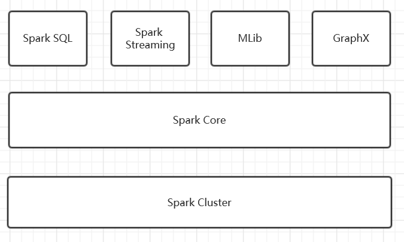

# Apache Spark™ - Unified Analytics Engine for Big Data

# Abstract

Spark is a general-purpose data processing engine that is suitable for use in a wide range of circumstances providing interfaces in a variety of programming languages including **Scala**, **Java** and **Python**. Application developers and data scientists incorporate Spark into their applications to rapidly query, analyze, and transform data at scale. Tasks most frequently associated with Spark include interactive queries across large data sets, processing of streaming data from sensors or financial systems, and machine learning tasks. As of 21-09-2018, the project has over 22,000 commits, 1285 contributors, 75 releases and has been forked over 16,000 times.

# Table of Contents

1. Overview
2. Context view
3. Deployment view
4. Architecture(Development view)
5. Evolution perspective
6. Summary
7. References

# 1.Overview

## 1.1 Introduction

Apache Spark is a fast and general-purpose cluster computing system. It provides high-level APIs in Java, Scala, Python and R, and an optimized engine that supports general execution graphs. It also supports a rich set of higher-level tools including Spark SQL for SQL and structured data processing, MLlib for machine learning, GraphX for graph processing, and Spark Streaming.

## 1.2 Spark DataType

RDD (Resilient Distributed Dataset), which is the most basic data abstraction in Spark. It represents aset that is immutable, partitioned, and whose elements can be calculated in parallel. RDD has the characteristics of data flow model: automatic fault tolerance, location-aware scheduling, and scalability. RDD allows users to explicitly cache working sets in memory while performing multiple queries, and subsequent queries can reuse working sets, which greatly increases query speed.

By introducing the concept of RDD, Spark provides efficient big data operations without incurs substantial overheads due to data replication, disk I/O, and serialization, which can dominate application execution times. In addition, RDDs are fault-tolerant, parallel data structures that let users explicitly persist intermediate results in memory, control their partitioning to optimize data placement, and manipulate them using a rich set of operators.

After evaluating RDDs and Spark through both microbenchmarks and measurements of user applications, we find that Spark is up to 20× faster than **Hadoop** for iterative applications, speeds up a real-world data analytics report by 40×, and can be used interactively to scan a 1 TB dataset with 5–7s latency.

## 1.3 Security

Spark currently supports authentication via a shared secret. Authentication can be configured to be on via the `spark.authenticate` configuration parameter. This parameter controls whether the Spark communication protocols do authentication using the shared secret. This authentication is a basic handshake to make sure both sides have the same shared secret and are allowed to communicate. If the shared secret is not identical they will not be allowed to communicate. The shared secret is created as follows:

- For Spark on YARN deployments, configuring `spark.authenticate` to true will automatically handle generating and distributing the shared secret. Each application will use a unique shared secret.
- For other types of Spark deployments, the Spark parameter `spark.authenticate.secret` should be configured on each of the nodes. This secret will be used by all the Master/Workers and applications.

##1.4 Applicable scenario

At present, big data processing scenarios have the following types:

1. Complex Batch Data Processing focuses on the ability to process massive Data. As for the tolerable Processing speed, the usual time may be from dozens of minutes to several hours.

2. Interactive Query based on historical data, which usually takes between tens of seconds and tens of minutes

3. Data Processing based on real-time Data flow, usually between hundreds of milliseconds and seconds

Currently, there are mature processing frameworks for the above three scenarios. In the first case, Hadoop's MapReduce can be used for bulk mass data processing, in the second case, Impala can be used for interactive query, and in the third case, Storm distributed processing framework can be used to process real-time streaming data. All of the above three are relatively independent, each of which has a relatively high maintenance cost, and the emergence of Spark can satisfy the requirements above.

Based on the above analysis, the Spark scenario is summarized as follows:

- Spark is a memory based iterative computing framework for applications that require multiple manipulation of a particular dataset. The more repeated operations are required, the greater the amount of data to be read and the greater the benefit, and the smaller the amount of data but the more intensive the calculation, the less benefit

- Because of RDD's features, Spark doesn't apply to applications that are asynchronous and fine-grained update states, such as the storage of web services or incremental web crawlers and indexes. It's just not a good model for that incremental change

- The statistical analysis whose amount of data is not particularly large, but requires real-time 

## 1.5 Technical Platform
There are some main deployment methods:
1.5.1 Standalone
Use the resource scheduling framework that comes with spark: (not dependent on other distributed management platforms)

Steps:
1. SparkContext connects to the Master, registers with the Master and applies for resources (CPU Core and Memory)
2. Master gets the resources on the Worker, then starts StandaloneExecutorBackend;
3. StandaloneExecutorBackend registers with SparkContext;
4. SparkContext sends the Applicaiton code to StandaloneExecutorBackend;
5. SparkContext parses the Applicaiton code, builds the DAG map, submits it to the DAG Scheduler and decomposes it into a Stage, and then submits it to the Task Scheduler in a Stage (or called TaskSet). 
6. The Task Scheduler is responsible for assigning the Task to The corresponding Worker is finally submitted to StandaloneExecutorBackend for execution;
7. StandaloneExecutorBackend will create an Executor thread pool, start executing the Task, and report to the SparkContext until the Task is completed.
8. After all Tasks are completed, SparkContext logs out to the Master and releases the resources.

1.5.2 Spark on Mesos
Mesos is an open source distributed resource management framework under Apache. It is called the kernel of distributed systems.
Spark is used to support multi-server simultaneous operations in the running of mesos.
Steps:
1. Submit the task to spark-mesos-dispatcher via spark-submit
2. spark-mesos-dispatcher submits to mesos master via driver and receives task ID
3. mesos master is assigned to the slave to let it perform the task
4. spark-mesos-dispatcher, query task status by task ID

1.5.3 Spark on YARN
Apache Hadoop YARN (Yet Another Resource Negotiator, another resource coordinator) is a new Hadoop resource manager, which is a universal resource management system.
It includes two main part:RM,AM
RM(Resource Manager):It allocates the required resource of the process. It acts as a JobTracker. It faces to the whole system;
AM(Application Manager):It manages and consoles the status and data of the process. It acts as a TaskTracker. It faces to every single process.

## 1.6 Installing Spark Standalone to a Cluster

To install Spark Standalone mode, you simply place a compiled version of Spark on each node on the cluster. You can obtain pre-built versions of Spark with each release or [build it yourself](http://spark.apache.org/docs/latest/building-spark.html).

### Starting a Cluster Manually

You can start a standalone master server by executing:

`./sbin/start-master.sh`

Once started, the master will print out a spark://HOST:PORT URL for itself, which you can use to connect workers to it, or pass as the “master” argument to SparkContext. You can also find this URL on the master’s web UI, which is http://localhost:8080 by default.

Similarly, you can start one or more workers and connect them to the master via:

`./sbin/start-slave.sh <master-spark-URL>`

Once you have started a worker, look at the master’s web UI (http://localhost:8080 by default). You should see the new node listed there, along with its number of CPUs and memory (minus one gigabyte left for the OS).

# Architecture

## High-level View

The high-level view is visualized in figure above.

Looking from upper level, every **Spark** application initiate a variety of parallel operations in cluster from a **driver program**. Program driver access Spark through a **SparkContext** object. This object represents a connection to the entire cluster. By default, a SparkContext object named `sc` will be created by shell automatically.

~~~python
>>> lines = sc.textFile("README.md")
>>> lines.count()
~~~

User can define RDDs through program driver and then initiate an operation. A simple example is presented above.

As soon as the driver program receive an operation, it will try to distribute the operation over all working nodes. Each working nodes will do a part of jobs and send result back to driver program.

## Component view 

The Component view is showed in the picture above.

Spark contains several components ,including Spark Core, Spark SQL, Spark Streaming, MLlib, GraphX and Cluster Manager. These components are closely related to each other, which means if we update one component, others can also be affected. By using this theory, Spark has had lots of advantages. And now, we'll introduce these components and show the relations among them.

### Spark Core
Spark Core implements the basic functions of Spark, including task scheduling, memory management, error recovery, and storage systems. It also defines an API for RDD(resilient distribute dataset).

### Spark SQL
Spark SQL is a package that Spark uses to manipulate structured data. With Spark SQL, we can use SQL Or the Apache Hive version of the SQL(HQL) to query data. Spark SQL supports multiple data sources, Such as Hive table, Parquet and JSON.

### Spark Streaming
Spark Streaming is a component of Spark that provides streaming computing for real-time data. Spark Streaming provides an API for manipulating data streams and is highly responsive to the RDD API in Spark Core.

### Spark MLlib
Spark also includes a library that provides machine learning (ML) features called MLlib. MLlib provides a variety of machine learning algorithms, including classification, regression, clustering, collaborative filtering, etc.

### Spark GraphX
GraphX is a library for manipulating graphs that can perform parallel graph calculations.

### Cluster Manager
Spark can efficiently scale calculations from one compute node to thousands of compute nodes.

## Evolution perspective

### history

###changes required

#### core

####IDE