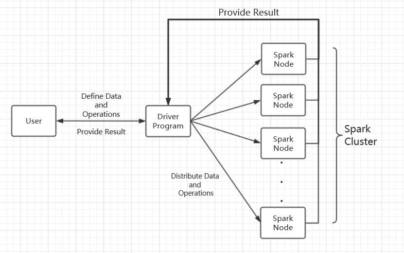

---

---

# Apache Spark™ - Unified Analytics Engine for Big Data

# Abstract

Spark is a general-purpose data processing engine that is suitable for use in a wide range of circumstances providing interfaces in a variety of programming languages including **Scala**, **Java** and **Python**. Application developers and data scientists incorporate Spark into their applications to rapidly query, analyze, and transform data at scale. Tasks most frequently associated with Spark include interactive queries across large data sets, processing of streaming data from sensors or financial systems, and machine learning tasks. As of 21-09-2018, the project has over 22,000 commits, 1285 contributors, 75 releases and has been forked over 16,000 times.

# Table of Contents

1. Overview
2. stakeholders
3. Deployment view
4. Architecture
5. Functional View
6. Evolution perspective
7. Summary
8. References

# 1 Overview

## 1.1 Introduction

**Apache Spark** is an open-source distributed general-purpose cluster-computing framework. Originally developed at the University of California, Berkeley's AMP Lab（AMP：Algorithms，Machines，People）, the Spark codebase was later donated to the Apache Software Foundation, which has maintained it since. Spark provides an interface for programming entire clusters with implicit data parallelism and fault tolerance. In 2009, was born at the university of California, Berkeley, AMP Lab, it was originally belongs to the research project at the university of Berkeley, in 2010 officially open source, and to the Apache foundation project is established in 2013, by 2014 will become the top for the Apache foundation project, the project the whole development course just over six years, but its development speed is very alarming.

Apache Spark has as its architectural foundation the resilient distributed dataset (RDD), a read-only multiset of data items distributed over a cluster of machines, that is maintained in a fault-tolerant way.In Spark 1.x, the RDD was the primary application programming interface (API), but as of Spark 2.x use of the Dataset API is encouraged even though the RDD API is not deprecated.

Spark and its RDDs were developed in 2012 in response to limitations in the MapReduce cluster computing paradigm, which forces a particular linear dataflow structure on distributed programs: MapReduce programs read input data from disk, map a function across the data, reduce the results of the map, and store reduction results on disk. Spark's RDDs function as a working set for distributed programs that offers a (deliberately) restricted form of distributed shared memory.

Spark facilitates the implementation of both iterative algorithms, that visit their data set multiple times in a loop, and interactive/exploratory data analysis, i.e.,  the repeated database-style querying of data. The latency of such applications may be reduced by several orders of magnitude compared to a MapReduce implementation (as was common in Apache Hadoop stacks). Among the class of iterative algorithms are the training algorithms for machine learning systems, which formed the initial impetus for developing Apache Spark.

Apache Spark requires a cluster manager and a distributed storage system. For cluster management, Spark supports standalone (native Spark cluster), Hadoop YARN, or Apache Mesos. For distributed storage, Spark can interface with a wide variety, including Hadoop Distributed File System (HDFS), MapR File System (MapR-FS), Cassandra, OpenStack Swift, Amazon S3, Kudu, or a custom solution can be implemented. Spark also supports a pseudo-distributed local mode, usually used only for development or testing purposes, where distributed storage is not required and the local file system can be used instead; in such a scenario, Spark is run on a single machine with one executor per CPU core.

Is due to the Spark from the university, its whole development process is full of academic research, academic is driving the development of the core structures of the Spark, such as elastic distributed data sets (RDD, resilient distributed datasets), flow processing (Spark streaming), and machine learning (MLlib), analysis of SQL (SQL) Spark and figure (Graph X) calculation, this section will introduce the main Spark development course and characteristics

## 1.2 Spark Datatype

RDD (Resilient Distributed Dataset), which is the most basic data abstraction in Spark. It represents a set that is immutable, partitioned, and whose elements can be calculated in parallel. RDD has the characteristics of data flow model: automatic fault tolerance, location-aware scheduling, and scalability. RDD allows users to explicitly cache working sets in memory while performing multiple queries, and subsequent queries can reuse working sets, which greatly increases query speed.

By introducing the concept of RDD, Spark provides efficient big data operations without incurs substantial overheads due to data replication, disk I/O, and serialization, which can dominate application execution times. In addition, RDDs are fault-tolerant, parallel data structures that let users explicitly persist intermediate results in memory, control their partitioning to optimize data placement, and manipulate them using a rich set of operators.

After evaluating RDDs and Spark through both microbenchmarks and measurements of user applications, we find that Spark is up to 20× faster than Hadoop for iterative applications, speeds up a real-world data analytics report by 40×, and can be used interactively to scan a 1 TB dataset with 5–7s latency.

## 1.3 Security

Spark currently supports authentication via a shared secret. Authentication can be configured to be on via the `spark.authenticate` configuration parameter. This parameter controls whether the Spark communication protocols do authentication using the shared secret. This authentication is a basic handshake to make sure both sides have the same shared secret and are allowed to communicate. If the shared secret is not identical they will not be allowed to communicate. The shared secret is created as follows:

- For Spark on YARN deployments, configuring `spark.authenticate` to true will automatically handle generating and distributing the shared secret. Each application will use a unique shared secret.
- For other types of Spark deployments, the Spark parameter `spark.authenticate.secret` should be configured on each of the nodes. This secret will be used by all the Master/Workers and applications.

## 1.4 Applicable scenario

At present, big data processing scenarios have the following types:

1. Complex Batch Data Processing focuses on the ability to process massive Data. As for the tolerable Processing speed, the usual time may be from dozens of minutes to several hours.

2. Interactive Query based on historical data, which usually takes between tens of seconds and tens of minutes

3. Data Processing based on real-time Data flow, usually between hundreds of milliseconds and seconds

Currently, there are mature processing frameworks for the above three scenarios. In the first case, Hadoop's MapReduce can be used for bulk mass data processing, in the second case, Impala can be used for interactive query, and in the third case, Storm distributed processing framework can be used to process real-time streaming data. All of the above three are relatively independent, each of which has a relatively high maintenance cost, and the emergence of Spark can satisfy the requirements above.

Based on the above analysis, the Spark scenario is summarized as follows:

- Spark is a memory based iterative computing framework for applications that require multiple manipulation of a particular dataset. The more repeated operations are required, the greater the amount of data to be read and the greater the benefit, and the smaller the amount of data but the more intensive the calculation, the less benefit

- Because of RDD's features, Spark doesn't apply to applications that are asynchronous and fine-grained update states, such as the storage of web services or incremental web crawlers and indexes. It's just not a good model for that incremental change

- The statistical analysis whose amount of data is not particularly large, but requires real-time 

## 1.5 Technical Platform
- Spark is created by Scala, it could run on JVM so we need Java7 or higher edition.
- If we use Python API, we need Python2.6+ or Python3.4+.
- Edition mapping:
Spark1.6.2--Scala2.10;
Spark2.0.0--Scala2.11;

## 1.6 Installing Spark Standalone to a Cluster

To install Spark Standalone mode, you simply place a compiled version of Spark on each node on the cluster. You can obtain pre-built versions of Spark with each release or [build it yourself](http://spark.apache.org/docs/latest/building-spark.html).

### Starting a Cluster Manually

You can start a standalone master server by executing:

`./sbin/start-master.sh`

Once started, the master will print out a spark://HOST:PORT URL for itself, which you can use to connect workers to it, or pass as the “master” argument to SparkContext. You can also find this URL on the master’s web UI, which is http://localhost:8080 by default.

Similarly, you can start one or more workers and connect them to the master via:

`./sbin/start-slave.sh <master-spark-URL>`

Once you have started a worker, look at the master’s web UI (http://localhost:8080 by default). You should see the new node listed there, along with its number of CPUs and memory (minus one gigabyte left for the OS).

# 2 stakeholders

## 2.1 The major contributors of Spark 

​	Born out of the Berkeley lab project, the core members of the Spark project team created Databricks in 2013, and so far have hosted consecutive Spark Summit summits in San Francisco from 2013. The conference was supported by major big data manufacturers Hortonworks, IBM, Cloudera, MAPR and Pivotal, as well as the cooperation of big data solution providers Amazon, DATASTAX and SAP.

 the major member of Spark, who mostly are major member of Databricks are:

- **Matei  Zaharia **(original author)
-  **Andy Konwinski**（ the organizer of Spark Summit）
- **Mike Franklin**（AMP Lab director）
- **Reynold Xin** (Spark lead architect）
- **Patrick Wendell**（One of Spark's most important contributors）
- **Ion Stoica**
- **Scott Shenker** 

## 2.2 Development of code contributors

 After the Spark development community was founded on GitHub and became an Apache incubator project in 2013, Spark has entered a period of rapid growth, with significant increases in both codebase submissions and community activity. In terms of activity, Spark ranks in the top three of all Apache foundation open source projects. Compared with other big data platforms or frameworks, Spark's code base is the most active, showing strong development momentum. Its development can be seen in the following figure.

## 2.3 The major users and distributors of Spark 

With the enlargement of the developer community, and constantly improve and progress of the project, the Spark of rising in influence, has been more and more users using this platform, including the traditional industrial manufacturer company of TOYOTA and famous Internet company Uber and reality, traditional Spark user fields continuously deepen to the cross area of the industry and the Internet and traditional industry. Not only that, more and more big data commercial publishers such as Cloudera and Hortonworks have also started to include Spark into their deployment range, which undoubtedly plays a huge role in Spark's commercial application and promotion, and on the other hand, shows the advanced nature of Spark platform technology.

 	Its major users and distributors  can be seen in the following figure.

​	Nowadays, spark has also stepped into China. Tencent，Alibaba，Youku, Wandoujia and more company at home and abroad are using spark to replace the old framework to improve efficiency.

## 2.4 Spark Meetup Groups

​	Since pioneering the summit in 2013, Spark Summits have become the world’s largest big data event focused entirely on Apache Spark—assembling the best engineers, scientists, analysts, and executives from around the globe to share their knowledge and receive expert training on this open-source powerhouse. Also, many thousands have come to learn how Spark, big data, machine learning, data engineering, and data science are delivering new insights to businesses and institutions worldwide.

​	In addition to the influential Spark Summit, the Spark community holds small meetups around the world on an irregular basis. In China, there are Meetup activities in Beijing, Shanghai and Shenzhen, which are supported by AsiaInfo, Microsoft and InfoQ. The Spark Meetup Group is already spread across North America, Europe, Asia and Oceania. The following figure shows a distribution of Spark Meetup Groups in the world.

# 3 Deployment View

## 3.1 Deployment methods:

### 3.1.1 Standalone
Use the resource scheduling framework that comes with spark: (not dependent on other distributed management platforms)

Steps:

1. SparkContext connects to the Master, registers with the Master and applies for resources (CPU Core and Memory)
2. Master gets the resources on the Worker, then starts StandaloneExecutorBackend;
3. StandaloneExecutorBackend registers with SparkContext;
4. SparkContext sends the Applicaiton code to StandaloneExecutorBackend;
5. SparkContext parses the Applicaiton code, builds the DAG map, submits it to the DAG Scheduler and decomposes it into a Stage, and then submits it to the Task Scheduler in a Stage (or called TaskSet). 
6. The Task Scheduler is responsible for assigning the Task to The corresponding Worker is finally submitted to StandaloneExecutorBackend for execution;
7. StandaloneExecutorBackend will create an Executor thread pool, start executing the Task, and report to the SparkContext until the Task is completed.
8. After all Tasks are completed, SparkContext logs out to the Master and releases the resources.

### 3.1.2 Spark on Mesos
Mesos is an open source distributed resource management framework under Apache. It is called the kernel of distributed systems.
Spark is used to support multi-server simultaneous operations in the running of mesos.
Steps:
1. Submit the task to spark-mesos-dispatcher via spark-submit
2. spark-mesos-dispatcher submits to mesos master via driver and receives task ID
3. mesos master is assigned to the slave to let it perform the task
4. spark-mesos-dispatcher, query task status by task ID

### 3.1.3 Spark on YARN
Apache Hadoop YARN (Yet Another Resource Negotiator, another resource coordinator) is a new Hadoop resource manager, which is a universal resource management system.
It includes two main part:RM,AM
RM(Resource Manager):It allocates the required resource of the process. It acts as a JobTracker. It faces to the whole system;
AM(Application Manager):It manages and consoles the status and data of the process. It acts as a TaskTracker. It faces to every single process.

# 4 Architecture

## 4.1 High-level diagram

The high-level view is visualized in figure above.

Looking from upper level, every **Spark** application initiate a variety of parallel operations in cluster from a **driver program**. Program driver access Spark through a **SparkContext** object. This object represents a connection to the entire cluster. By default, a SparkContext object named `sc` will be created by shell automatically.

~~~python
>>> lines = sc.textFile("README.md")
>>> lines.count()
~~~

User can define RDDs through program driver and then initiate an operation. A simple example is presented above.

As soon as the driver program receive an operation, it will try to distribute the operation over all working nodes. Each working nodes will do a part of jobs and send result back to driver program.

## 4.2 Component diagram 

The Component view is showed in the picture above.

Spark contains several components ,including Spark Core, Spark SQL, Spark Streaming, MLlib, GraphX and Cluster Manager. These components are closely related to each other, which means if we update one component, others can also be affected. By using this theory, Spark has had lots of advantages. And now, we'll introduce these components and show the relations among them.

1.Spark Core:
Spark Core implements the basic functions of Spark, including task scheduling, memory management, error recovery, and storage systems. It also defines an API for RDD(resilient distribute dataset).

2.Spark SQL:
Spark SQL is a package that Spark uses to manipulate structured data. With Spark SQL, we can use SQL Or the Apache Hive version of the SQL(HQL) to query data. Spark SQL supports multiple data sources, Such as Hive table, Parquet and JSON.

3.Spark Streaming:
Spark Streaming is a component of Spark that provides streaming computing for real-time data. Spark Streaming provides an API for manipulating data streams and is highly responsive to the RDD API in Spark Core.

4.Spark MLlib:
Spark also includes a library that provides machine learning (ML) features called MLlib. MLlib provides a variety of machine learning algorithms, including classification, regression, clustering, collaborative filtering, etc.

5.Spark GraphX:
GraphX is a library for manipulating graphs that can perform parallel graph calculations.

6.Cluster Manager:
Spark can efficiently scale calculations from one compute node to thousands of compute nodes.

### Layer Structure

The Components we list above are organized in a Layer Structure. Spark Core is the basic layer which can create RDD and basic function to support the upper layer. Spark SQL, Spark Streaming, MLlib and GraphX consist the second layer, which implements most of the function of Spark. The top layer is a Cluster Master which can organize the task created by users. By using this structure, Spark is easy to learn and use. What's more, it can be deployed in different platforms and work efficiently.   

## 4.4 Component and Connector diagram

After the Spark cluster is deployed, you need to start the Master process and the Worker process on the master node and the slave node respectively to control the entire cluster. Driver and Worker are two important roles in the execution of a Spark application. The Driver program is the starting point for the execution of the application logic. It is responsible for the scheduling of jobs, that is, the distribution of Task tasks, and multiple Workers are used to manage computing nodes and create Executor parallel processing tasks. In the execution phase, the Driver serializes the files and jars that the Task and Task depend on and passes them to the corresponding Worker machine. At the same time, the Executor processes the tasks of the corresponding data partitions.

The basic parts of Spark's architecture in the runtime:

• Cluster Manager: In the standalone mode, it is the master node, which controls the entire cluster and monitors the workers. Resource manager in YARN mode

• Worker: The slave node is responsible for controlling the compute node and starting the Executor or Driver. In the YARN mode, it is the NodeManager, which is responsible for the control of the computing node.

• Driver: Run the main() function of the Application and create a SparkContext.

• Executor: The executor, the component that performs the task on the worker node, and the task that is used to start the thread pool. Each Application has a separate set of Executors.

• SparkContext: The context of the entire application, controlling the lifecycle of the application.

• RDD: The basic computing unit of Spark, a set of RDDs can form a directed acyclic graph RDD Graph.

• DAG Scheduler: Build a Stage-based DAG based on the task and submit the Stage to the TaskScheduler.

• TaskScheduler: Distribute tasks to Executor for execution.

• SparkEnv: A thread-level context that stores references to important portions of the runtime.

## 4.5 Discussion

In terms of architecture design, functionalities and modules are pretty independent. With the help of Cluster Manager, it can easily organize its job in different platforms after it is deployed. In the Deployment View, I'd like to show how exactly it organizes its resources, tasks and data.

If you want to know how the modules of spark system are coordinated to finish a job in details (like production, submission, execution, results collection, results computation and shuffle), you can read the source code and some articles about it.

# 5 Functional View

| Class | Explanation |
| ---| --- |
| SparkContext: | Main entry point for Spark functionality. |
| RDD: | A Resilient Distributed Dataset (RDD), the basic abstraction in Spark. |
| Broadcast: | A broadcast variable that gets reused across tasks. |
| Accumulator: | An “add-only” shared variable that tasks can only add values to. |
| SparkConf: | For configuring Spark. |
| SparkFiles: | Access files shipped with jobs. |
| StorageLevel: | Finer-grained cache persistence levels. |
| TaskContext: | Information about the current running task, available on the workers and experimental. |

In the core section of Spark API, `SparkContext` serves as the main entry point for Spark functionality. A SparkContext represents the connection to a Spark cluster, and can be used to create RDD and broadcast variables on that cluster. `Broadcast`, `RDD`, `Accumulator` are variables created by `SparkContext` and can be used to represents the computation process. A broadcast variable created with SparkContext.broadcast(). Access its value through value. A `Accumulator` is a shared variable that can be accumulated, i.e., has a commutative and associative “add” operation. Worker tasks on a Spark cluster can add values to an Accumulator with the += operator, but only the driver program is allowed to access its value, using value. While SparkContext supports accumulators for primitive data types like int and float, users can also define accumulators for custom types by providing a custom AccumulatorParam object. Refer to the doctest of this module for an example. Contextual information about a task which can be read or mutated during execution. To access the TaskContext for a running task, use: TaskContext.get().

# 6 Evolution perspective

## 6.1 Overview
The	evolution perspective deals with concerns related to evolution during the lifetime of a system. This is relevant to Spark because it is a system where a large amount of change needs to be handled. Throughout	the years, Spark has evolved a lot. At this moment Arduino has 34 releases, which started with release Spark 0.6.0  in October 15th, 2012 and the latest release 2.3.0 in February 28th, 2018. However the real first release is 0.1.0 in 2009 in UC Berkeley's Lab, but this can't be found on the GitHub repository anymore. This is probably because it was an alpha version and this project has become open-sourced in 2010.

In order to understand the changes in the various releases, the changelogs and release notes have been analyzed.
The	changes in spark and the conclusion we made are as below.

## 6.2 spark's history  

Starting as an academic research project, Spark has only been a hot topic in the field of big data for about 6 years, from its inception to its popularity abroad. The detailed development details are as follows：

- Spark was born in Berkeley AMP Lab in 2009.
- The project was open source earlier in 2010, and many of the early ideas for Spark systems were published in various papers.
- After the project was open source, the Spark development community was founded on GitHub and became an Apache incubator project in 2013.
- The project became Apache's top project in February 2014.
- On May 30, 2014, Spark 1.0.0 was officially launched.
- By 2015, Spark's official maintenance and operations company Databricks had organized and hosted the Spark Summit technology Summit for three years.

The figure below shows the timeline of the important  improvement in spark's development.

### 6.2.1 Spark Component history

The formal component of spark's current ecosystem took place when spark1.0 was released. It is shown in the figure below. 

In spark's 1.0.x versions, the developer had been trying to update these components and fix bugs. Until the end of 2016, all the component had tend to be impeccable.

### 6.2.2 Spark core API history

- Spark's first generation API: RDD

  **Five core features of RDD:**

  - A list of partition
  - A function for computing each split
  - A list of dependencies on other RDDs
  - Optionally, a Practitioner for key - value RDDs (e.g. To say that the RDD is hash partitioned)
  - Optionally, a list of preferred locations to compute each split on (e.g., block locations for an HDFS file)

- Spark second generation API: Data Frame

  **Data Frame core features:**

    - The column containing the ROW data for each ROW, at which time the Data Frame is Table; 
    - Tungsten: new execution engine
    - Catalyst: new syntax parsing framework

**This change improve computing efficiency, reduce data reading, and optimize underlying computing.**

- Spark third generation API: Data Set

  Core values and benefits of Data Set: Encoder

  **Data Set core features:**

  - Type safety check at compile time,

  - no type mismatch is found at execution time. 

  - Performance is greatly improved

**This change greatly reduced memory usage, reduced GC;**

​		      **greatly reduce the transmission of network data;**

​		      **dramatically reduces the difference between using Scala and Java to code.**

## 6.3 Spark‘s changes required

Since 2014, Spark's open source ecosystem has grown significantly and has become one of the most active open source projects in the big data category. The reason why Spark has so much attention is that tableland is mainly due to Spark's features of high performance, high flexibility and perfect integration with Hadoop ecosystem.

However, with so much advantages, Spark itself still has many drawbacks that need to be solved.

So the Spark future the main developing direction includes the following several aspects:

### Memory footprint aspect 

The JVM's memory overhead is too large. A gigabyte of data usually needs to consume 5G, which greatly increases the memory consumption of computing. Also,  different Spark apps lack effective memory sharing mechanism. Spark is addressing this problem by constantly optimizing the code. 

### Stability aspect

Spark's long running can often go wrong due to code quality problems. On the architecture side, Spark's performance is not stable due to a large amount of data being cached in RAM and Java recycling garbage being slow. In addition, SQL performance is not even as good as existing Map/Reduce in complex scenarios.

Spark is trying a number of ways to solve this problem, such as removing experimental tag;removing support for Java 7; removing support for Hadoop 2.5 and earlier

### Dealing with big data

spark now  unable to deal with big data, too large data can be processed by a single machine, or the intermediate results exceed the size of RAM due to data problems, often resulting in insufficient RAM space or inability to get results. However, the Map/Reduce algorithm framework can handle big data, and Spark is less effective than the Map/Reduce algorithm framework in this regard.

### SQL Operations

complex SQL statistics cannot be supported. At present, the complete level of SQL syntax supported by Spark cannot be applied in the analysis of complex data. In the aspect of manageability, the combination of Spark-YARN is not perfect, which leads to the hidden trouble in the use process and various puzzles.

Spark now support for reading data from Hive megastore 2.0/2.1; support parsing multi-line JSON or CSV files; the API provided by Structured Streaming for the R language; The R language supports the full Catalog API; The R language supports Data Frame checkpointing and so on  to change the status quo.

# 7.Quality attribute
## 7.1 Modifiability
Spark is very easy to integrate with other open source products. For example, Spark can use Hadoop's YARN and Apache Mesos as its resource management and scheduler, and can handle all Hadoop-supported data, including HDFS, HBase, and Cassanda. This is especially important for users who have deployed a Hadoop cluster, because Spark's powerful processing power can be used without any data migration.
Spark can also rely on third-party resource managers and schedulers. It implements Standalone as its built-in resource manager and scheduling framework, which further reduces the usage threshold of Spark, making it easy for everyone to deploy and use Spark. 
In addition, Spark also provides tools for deploying Standalone's Spark cluster on EC2.
## 7.2 Security
We have mentioned this in part 1.3
## 7.3 Performance
Compared to Hadoop's MapReduce, Spark's memory-based computing is more than 100 times faster; disk-based computing is more than 10 times faster. Spark implements an efficient DAG execution engine that efficiently processes data streams based on memory.
## 7.4 Ease of use
Spark supports Java, Python, and Scala APIs, and supports more than 80 advanced algorithms, allowing users to quickly build different applications. And Spark supports interactive Python and Scala shells, which means that Spark clusters can be easily used in these shells to validate problem-solving methods, rather than packaging, uploading clusters, validation, etc., as before. This is very important for prototyping.
## 7.5 Usability and Reliability
### Driver HA
Since the stream computing system is long-running and data is constantly flowing in, the reliability of the Spark daemon (Driver) is crucial. It determines whether the Streaming program can run correctly.

1.Persistence

2.Recovery

The solution for Driver to implement HA is to persist the metadata so that the state recovery after restart

• Block metadata: the data received by Receiver from the network, assembled into Block metadata generated after the Block;

• Checkpoint data: including configuration items, DStream operations, unfinished batch status, and generated RDD data;

### Reliable upstream and downstream IO system
Stream computing mainly implements data interaction with an external IO system through network socket communication. Due to the unreliable characteristics of network communication, the transmitting end and the receiving end need to ensure a receiving acknowledgement of the data packet and a failure retransmission mechanism through a certain protocol.

Not all IO systems support retransmission, which requires at least a data stream to be persisted while achieving high throughput and low latency. In the data source officially supported by Spark Streaming, only Kafka can meet these requirements at the same time. Therefore, in the recent Spark Streaming release, Kafka is also regarded as the recommended external data system.
A typical enterprise big data center data flow view is shown below

### Reliable receiver
Prior to Spark 1.3, Spark Streaming completed the flow of data from Kafka clusters by launching a dedicated Receiver task.

### Write-ahead log Write Ahead Log
Spark 1.2 began to provide pre-write logging capabilities for persistence and failure recovery of Receiver data and Driver metadata. WAL is able to provide persistence because it uses reliable HDFS for data storage.

The core APIs of the Spark Streaming write-ahead logging mechanism include:

• WriteAheadLogManager that manages WAL files

• Read/write WAL's WriteAheadLogWriter and WriteAheadLogReader

• WAL-based RDD: WriteAheadLogBackedBlockRDD

• WAL-based Partition: WriteAheadLogBackedBlockRDDPartition

